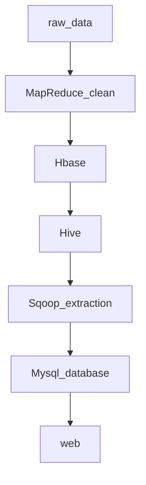

Sqoop (sql-to-Hadoop) is an tool to convet data between ralational database and hadoop 

## structure
* sqoop get shell or java api command from client
* these tasks are tranformed into MapReduce tasks by Task Translator in Sqoop
* data between relational database and hadoop are transfered for computation and visualization
## implementation
### Sqoop import to hdfs

    # --conect: option to specify database name to connect
    # --table: option to spedify table name to read
    # --username/--password: option to specify username and password
    # --target-dir: specify hdfs directory for data storage
    # --fields-terminated-by: specify seperator
    # --m: specify map tasks number in concurrency
    # --
    sqoop import --connect     jdbc:mysql://hadoop80:3306/hive     --table  consumer                --username root --password  admin    --target-dir /outdir/  --fields-terminated-by '\t'  -m 1 
### incremental append
only transfer teh updated part in table to hadoop, if old data exist
    # --incremental append: activate incremental append option
    # --check-column: the column id as reference column to append
    # --last-value: last value in the reference column
    sqoop import --connect     jdbc:mysql://hadoop80:3306/hive     --table  consumer                --username root --password  admin    --target-dir /outdir/  --fields-terminated-by '\t'  -m 1   --incremental append  --check-column  id  --last-value  4
### import in batch

    #create a shell job 
    #the job can be run with sqoop job –exec
    sqoop   job  --create   job001 --  import --connect     jdbc:mysql://hadoop80:3306/hive --table  consumer --username root --password  admin --target-dir /outdir/ --fields-terminated-by '\t'  -m 1 
### Sqoop import to hive

    #--hive-import: activate import to hive option
    #--create-hive-table: activate create new table option, if table already exists then throw error
    #--hive-table: specify databasename and tablename
    sqoop import --connect jdbc:mysql://hadoop80:3306/hive  --table consumer     --username root --password admin --hive-import  --create-hive-table  --hive-table d1.table1                  --fields-terminated-by  '\t'  -m 1
### Sqoop import to hbase

    #--hbase-create-table: activate create new table option on hbase
    #--hbase-table: specify table name
    #--column-family: specify column family name in table
    #--hbase-row-key:  specify RowKey in table
    #--null-string: specify default replacement if input string is empty
    #
    sqoop import --connect jdbc:mysql://hadoop80:3306/hive  --table consumer    --username root --password admin    --hbase-create-table     --hbase-table A      --column-family infor --hbase-row-key id --fields-terminated-by '\t'  -m 1
### Sqoop export
exportin hdfs data to relational database

    #--table: specify table name
    #--export-dir: specify exportation directory of database
    
    sqoop export --connect jdbc:mysql://hadoop80:3306/hive  --table consumer   --username  root --password admin  --export-dir  /outdir/  --fields-terminated-by '\t'  -m 1